\setlength{\parindent}{0pt}

```{r global_options, include=FALSE}
knitr::opts_chunk$set(echo = TRUE, tidy = TRUE, fig.align="center")
```
\newpage
# Introduction
_Artificial neural networks_ (or in short _neural networks_) refer to systems of interconnected components (neurons) that are loosely inspired from neural networks that make up the biological brains. This kind of the systems is increasingly popular among researchers, becoming the go-to approach to problems in various areas such as computer vision, natural language processing, signal processing, etc. Within this class of machine learning algorithms, feedforward neural networks, or multilayer perceptrons, are the quintessential deep learning models @Goodfellow-et-al-2016.

In this thesis, we focus on applications of neural networks, especially feedforward neural networks, in the field of survival analysis, a branch of statistics that concerns the time to the occurrence of one or more events @stata-intro-survival. This thesis is structured as follows: 

- Chapter 2: Theoretical Framework & Literature Review\
We start by introducing the feedforward neural network, including its basic structure, and its application in the field of survival analysis. We then review some of the models using feedforward neural networks in survival analysis.
- Chapter 3: Experiments & Results\
This chapter focuses on tuning, training and benchmarking DeepHit model. This chapter starts by introducing the pipeline used for preprocessing the data, the set of hyperparameters of DeepHit and the strategy used for tuning, training and benchmarking it. We then propose four experimental settings and start benchmarking them with the 8 datasets provided by the supervisors and testing the performance of our final models (after being trained with full data) with the blackbox test data as a part of The Prediction Challenge. We close the chapter with some remarks about DeepHit's performance on the 8 datasets.
- Chapter 4: Conclusion\
This chapter presents the results of this thesis, including what we have learned, what we achieved through the experiments, and also the difficulties we met when working on model tuning, training, and benchmarking.
- Appendix:\
The appendix is included for further reading. In this part, we introduce 2 models using RNN in survival analysis and also the plots and tables from the experiments we present in chapter \@ref(experiments-results).

# Theoretical Framework & Literature Review
This chapter provides information on background knowledge of feedforward neural networks and how they are applied to survival analysis. The next subsections presents publications related to this topic.

## Feedforward Neural Networks
This section discusses feedforward neural networks' basic structure and briefly their application to survival analysis.

### Basic Structure
To have a better grasp of what feedforward neural networks are and do, we start with a single neuron, the basic building block of a neural network. In the context of machine learning, we can think of a neuron as one "learning unit". To put it simple, a neuron is a function that takes input and applies linear transformations, along with an element-wise (non-)linear operation to produce the final output:
$$f(\mathbf{x}) = \sigma (\sum_{j=1}^{p}w_j x_j + b), \mathbf{w} \in \mathbb{R}^p , b \in \mathbb{R}$$
```{r feedforward-neural-network, echo=FALSE, out.width="70%", fig.cap="A Feedforward Neural Network"}
# All defaults
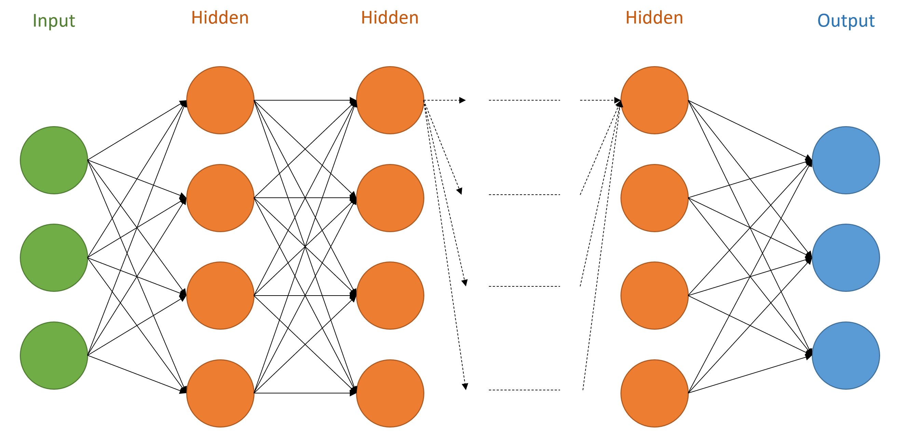
```

In the context of feedforward neural networks, function like $\sigma$ is called _activation function_, $\mathbf{w}$ is a neuron's _weight vector_ and $b$ is the _bias_ of a single neuron. Multiple neurons form a layer/mapping function and multiple layers chained together form a neural network. Each layer plays the role of transforming the input representation to another representation. In short, a feedforward neural network can be seen as a chain of mappings from original input to the final desired output:
$$f(\mathbf{x}) = f^{(n)}(f^{(n-1)}(...f^{(2)}(f^{(1)}(\mathbf{x}))...))$$
where $f^{(i)}(\mathbf{x})$ represents the transformation that the $i$-th layer of the neural network applies to the input $\mathbf{x}$ @Goodfellow-et-al-2016.

The term "feedforward" comes from the nature of this neural network operation: the information is passed through the network from the input to multiple intermediate computations and ends at the output layer. Additionally, there is no feedback loop where the outputs of the network are passed back to the network @Goodfellow-et-al-2016. The graphical representation of this neural network can be seen in Figure \@ref(fig:feedforward-neural-network). The figure presents three main components of a feedforward neural network: 
\vspace{-0.4cm}

- An input $\mathbf{x}$ as a column vector.
- Multiple hidden layers $\mathbf{z}^{(i)} = \sigma^{(i)} (\mathbf{W^\intercal z^{(i - 1)}} + \mathbf{b^{(i)}}), \mathbf{z}^{(0)} = \mathbf{x}$, where $\sigma$ is the hidden layer element-wise activation function, $\mathbf{W}$ represents the weight matrix of the hidden layer and $\mathbf{b}$ is the bias of the hidden layer
- An output layer $f = \tau (\mathbf{U}^{T}\mathbf{z}^{(I)} + \mathbf{c})$, where $\tau$ is the output layer element-wise activation function, $\mathbf{U}$ represents the weight matrix of the output layer and $\mathbf{c}$ is the bias of the output layer.
\vspace{-0.5cm}

The weight matrices and bias vectors of layers are considered to be the set of parameters $\boldsymbol\theta$ of the feedforward neural network.

___Representation Learning___\
Representation learning is one of the reasons why neural network is prominent nowadays. It is essential for a machine learning model to be fed with the "right" features/data representations for it to perform well @deeplearning-lmu. Before neural network, complex data representations were usually handcrafted by domain experts. This preprocessing task requires a great deal of time and effort @Goodfellow-et-al-2016. Neural network deals with this problem by automatically learning the data representations. With non-linear activation function, each hidden layer of a neural network outputs a more complex and abstract representation built upon its simpler representation from the previous layer or input @Goodfellow-et-al-2016. The more hidden layers or the deeper the network, the more non-linearities and abstractions are introduced. Therefore, a sufficiently deep neural network has the capacity to learn and represent highly sophisticated concepts with minimal human intervention @Goodfellow-et-al-2016.


___Training Feedforward Neural Network___\
To train a neural network, or a machine learning algorithm in general, two things need specifying: a(n) _(empirical) risk function_ (or _loss function_) and an _optimizer_.
\vspace{-0.5cm}

- Most modern neural networks utilize negative log-likelihood as the risk function, which is equivalent to the cross-entropy between the data and the model distribution @Goodfellow-et-al-2016. Depending on the model distribution, the form of the negative log-likelihood is specified accordingly. 
- An optimizer is an algorithm used to minimize the empirical risk, e.g. _stochastic gradient descent_ (SGD) @gds-optimization, _Adam_ @adam-optimizer. It uses the gradient calculated by some methods to perform learning. A popular method for computing the gradient is _back-propagation_ @backprop, which allows the information of the prediction loss to flow backward through the network @Goodfellow-et-al-2016. 

### Application to Survival Analysis
Regarding survival analysis, the Cox Proportional Hazards (CPH) @cox-ph is a classic regression model and also the most widely used model in the medical setting @deephit. Because of its simplicity, it can be interpreted and optimized easily. However, this model makes many strong assumptions about the underlying stochastic process and linear relationship between the covariates and the parameters of the model. These assumptions cost CPH the flexibility to deal with more complicated scenarios. Therefore, it makes sense to think of models that can handle all of that, and feedforward neural network is one of them. Feedforward neural network delivers the ability to deal with non-linear effects and interactions. It can be used to relax some of the constraints that were previously put on the hypothesis space, e.g. the assumption on the relationship between the covariates and the parameters of the survival analysis model @Faraggi-and-Simon-1995 @Katzman-et-al-2016 @luck2017deep @deephit.\
Moreover, with CPH and many other models, researchers need to feed the model "right" features (data representations) to obtain good results. It is, however, difficult to discover those features because they might be very high-level and abstract, along with their complicated interactions. Feedforward neural networks solve this problem by automatically learning representations that are expressed in terms of simpler representations, enabling the system to build sophisticated concepts out of uncomplicated ones @Goodfellow-et-al-2016.

## Feedforward Neural Network Models in Survival Analysis
In the following subsections, multiple models that apply feedforward neural network to survival analysis are introduced briefly. The list includes: Faraggi and Simon's model (1995) @Faraggi-and-Simon-1995, Deep Surv (2016) @Katzman-et-al-2016, Luck et al.'s model (2017) @luck2017deep, and DeepHit (2018) @deephit.

### Faraggi and Simon's Model (1995)
One of the first applications of feedforward neural networks to survival analysis is from Faraggi and Simon 1995 @Faraggi-and-Simon-1995. They used a shallow feedforward neural network to learn the non-linear relationship between the covariates and the parameters of the model instead of linear function in the case of CPH.\
With CPH, the hazard function has the form:
$$h(t|\mathbf{x}) = h_0(t)\exp(\mathbf{\boldsymbol\beta}^\intercal \mathbf{x})$$
The authors proposed to replace the linear functional $\mathbf{\boldsymbol\beta}^\intercal \mathbf{x}$ with the output from the neural network $g(\mathbf{x},\boldsymbol\theta)$. Their neural network structure is straightforward: they used one hidden layer with sigmoid element-wise activation function and used weighted sum on the output of the hidden layer to get the final output:
$$f = \mathbf{u}^\intercal\mathbf{z}+c=\mathbf{u}^\intercal\sigma(\mathbf{w}^\intercal\mathbf{x} + \mathbf{b}) + c$$
where $\sigma(x)=\frac{1}{1+exp[-x]}$ (sigmoid function). The value for $\boldsymbol\theta$ was found by maximizing the penalized Cox partial likelihood @cox-partial-likelihood with L2 regularization using Newton-Raphson method.

Though this work failed to demonstrate improvements beyond the linear Cox model @Faraggi-and-Simon-1995 @Katzman-et-al-2016, Faraggi and Simon pioneered in illustrating the possibility of applying neural networks into dealing with statisticians' problems, e.g. survival analysis in this case.

### DeepSurv (Katzman et al.) (2016)
In 2016, Katzman et al. attempted to improve the architecture that Faraggi and Simon proposed in 1995 @Faraggi-and-Simon-1995 and called the upgraded version DeepSurv @Katzman-et-al-2016.

The structure of DeepSurv is similar to Faraggi and Simon except for the followings: it has more than one hidden fully-connected layer and the hidden layers' activation function is Rectified Linear Units (ReLU) @relu instead of sigmoid function; the loss for DeepSurv is minimized by stochastic gradient descent (SGD) with Nesterov momentum. DeepSurv also applies other new deep learning techniques, which were not available in 1995, i.e. weight decay regularization @wdr, batch normalization @batch-normalization, dropout @dropout, etc.

As a result, Katzman et al. showed that the neural network solution to survival analysis problem was better in prediction ability than the standard linear Cox proportional hazards model, which was not the case for Faraggi and Simon in 1995.

### Luck et al.'s Model (2017)
Previous similar works on survival analysis attempted to model the hazard function or the survival function @Faraggi-and-Simon-1995 @Katzman-et-al-2016. Luck et al., however, tried a different approach: they used the feedforward neural network to deal directly with the (discrete) time of the event.

The structure of their model is as follows: Regarding hidden layers, the first hidden layers are fully connected and the last hidden layer is a single scalar unit outputting the relative risk, which is analogous to the term $\exp(\mathbf{\boldsymbol\beta}^\intercal \mathbf{x})$ in the case of CPH's hazard function; the output layer of the network with sigmoid activation function has $T$ units, each represents the probability of being alive at time $t$ (t-th year or month) @luck2017deep.

The loss function for this work comprises of two components: the first component uses the Efron's estimation of the Cox partial likelihood @efron-partial-likelihood and the second component is an adapted loss from Menon et al. @menon-ranking to take into account the correct ranking information of pairs of individuals when learning the probabilities (an event bound to occur at time t must have higher probability than another event happening at a later point in time). 

For evaluation, the authors first preprocessed on the dataset by missing value imputation (median value for continuous features and mode for categorical features). The training part was done with Adam optimizer, along with dropout, batch-normalization, etc. The hyperparameters were tuned by random search. And the benchmark was carried out with performance metric C-index @c-idx. As a result, the authors' model outperformed other common methods for survival analysis, including the CPH model and a network trained on the Cox partial likelihood @luck2017deep.

### DeepHit (Lee et al.) (2018)
DeepHit is a feedforward multi-task neural network created to work with discrete time survival analysis and competing risks @deephit. Many works before DeepHit dealt with survival time problem using feedforward neural network. However, they presented limitation by assuming a specific form of underlying stochastic process and also the constant hazard ratio @Faraggi-and-Simon-1995 @Katzman-et-al-2016 @luck2017deep. Regarding DeepHit, it __does not__ make any of the above assumptions, instead, this method attempts to learn directly the distribution of survival times:
\begin{equation}
P(T^* = t, K^* = k|\mathbf{x^*}=\mathbf{x})
\end{equation}
where random variables $T^*$ and $K^*$ represent true event time and true event, respectively. Moreover, with this way, DeepHit can also have the ability to adapt to changing relationships between the covariates and the event(s) of interest over time @deephit.

(ref:deephit-caption) DeepHit Architecture with two Competing Risks [@deephit]
```{r deephit-architecture, echo=FALSE, out.width="70%", fig.cap="(ref:deephit-caption)"}
# All defaults
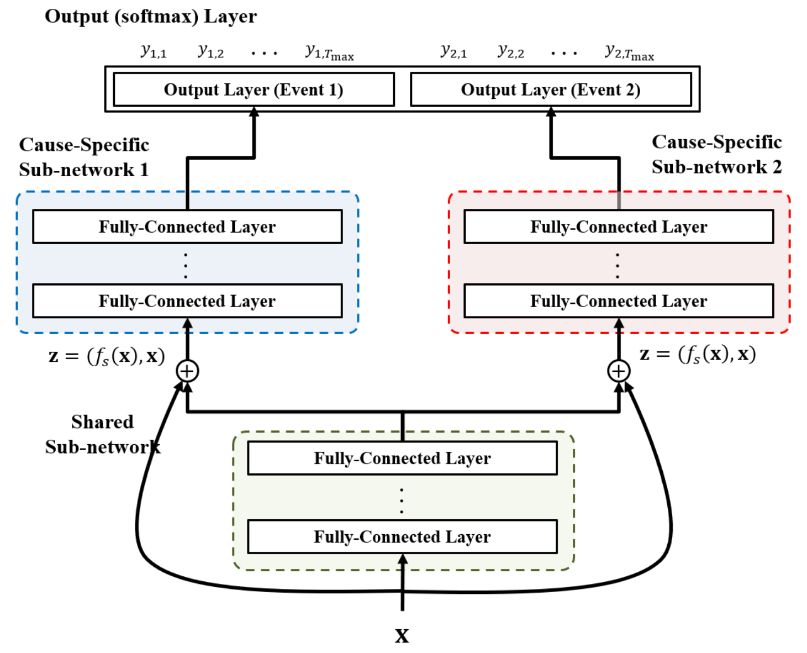
```

An example of DeepHit's architecture with two competing risks can be seen in Figure \@ref(fig:deephit-architecture). In general, DeepHit's architecture is structured as a multi-task neural network:
\vspace{-0.5cm}

- A _shared sub-network_: This sub-network comprises of one fully-connected layer. The original inputs of the model $\mathbf{x}$ first go through this sub-network to output a latent and complex representation that will be used by the rest of the network $f_s(\mathbf{x})$.
- $K$ _cause-specific sub-networks_: Each of these sub-networks has two fully-connected layers and takes inputs in pairs $\mathbf{z} = (f_s(\mathbf{x}), \mathbf{x})$ and generates the output as vector $f_{c_k}(\mathbf{z})$. To be specific, the cause-specific sub-network takes in two types of inputs: the original inputs of the model and the outputs from the shared sub-network. In this way, DeepHit can take advantage of shared common latent representation without losing information about the non-common part of the latent representation. The outputs of these sub-networks $f_{c_k}(\mathbf{z})$ correspond to the probabilities of event times for each of the causes.
- An _output layer_: This final layer of the network combines the results from $K$ cause-specific sub-networks, and applies softmax activation function to transform them into the final output, which has the form $y = [y_{1,1},...,y_{1,T_{max}},..., y_{K,1}, y_{K,T_{max}}]$, where $T_{max}$ is a finite time horizon. This represents the joint distribution of the event times and the events: given the covariates $\mathbf{x}$, DeepHit outputs the probability estimate $y_{k,s} = \hat{P}(t, k|\mathbf{x})$ that event $k$ will happen at time $t$ for each event and for each time interval in the discrete time set $\mathcal{T}$.

The loss function of DeepHit is defined as the sum of the two losses $\mathcal{L}_1$ and $\mathcal{L}_2$, which incorporates the log-likelihood of the joint distribution of the event time ($\mathcal{L}_1$) and the combination of cause-specific ranking loss functions ($\mathcal{L}_2$) @deephit:
\vspace{-0.5cm}

- $\mathcal{L}_1$: This loss represents the negative log-likelihood of the joint distribution of the event times and the events. The loss was modified to be able to account for the right-censored data, adapted from the paper of Lee and Whitmore in 2006 @Lee_2006. In general, with uncensored data, the loss captures both the event that has happened and the times to that event; on the other hand, with right-censored data, this loss possesses the knowledge that the individual still survives at censoring time and that the first hitting event will be one of the $K$ causes after the given censoring time @deephit. This helps the neural network to learn the general representation of the joint distribution of the event times and the events. 
- $\mathcal{L}_2$: This loss was inspired from the idea of concordance: an individual with event time $t$ should have a higher risk at time $t$ than the other individual with event time greater than $t$. It integrates into the total loss the ordering/ranking information about pairs of individuals with respect to each event. This in turn helps fine-tune the neural network towards the correct ordering of pairs with respect to each event.

<!-- For evaluation, DeepHit's authors used 5-fold cross validation. Furthermore, 20% of the data of the training set was used as validation set. Hyper-parameters for $\mathcal{L}_{total}$ such as $alpha$ and $\sigma$ were chosen based on the performance on validation set. For hidden layers, the number of nodes was set to be 3, 5, and 3 times of the original input dimension for the layer 1, 2, and 3, respectively. ReLU was chosen as the activation function for these hidden layers. Training was carried out using back-propagation via Adam optimizer, batch size of 50, learning rate of $10^{-4}$. All layers were applied Dropout probability 0.6 and Xavier initialization. The _time-dependent concordance index_ ($C^{td}$) was chosen as the performance metric for evaluating the performance of the model to be able to take into account the change in risk over time @ctd-idx. -->
For evaluation, DeepHit's training part was done with Adam optimizer, Dropout, Xavier initialization @xavier-init. Furthermore, DeepHit's authors applied train-validation split to choose the best set of hyperparameters. The benchmarks were done against multiple previous state-of-the-art models/methods, including cause-specific methods and single risk methods. Before experimenting, data from the real-world datasets was also preprocessed: imputating missing values with mean value for real-valued features and with the mode for categorical features. As a result, DeepHit outperformed other models used for benchmarks in both settings for single cause and competing risks with statistically significant results @deephit.

### Summary
To sum up, model of Faraggi and Simon 1995, DeepSurv, model of Luck et al. and DeepHit can cope with non-linear effects and interactions because of the use of feedforward neural network in predicting. Moreover, by taking advantage of deep neural network to learn directly the joint distribution of the events and event times, DeepHit captures successfully the changing relationship between the covariates and the risk(s) over time (time-varying effects). It is also able to work smoothly and naturally with competing risks where there are more than one event of interest.\
However, the four methods have multiple drawbacks. The models themselves do not have a natural way of dealing with missing data. Therefore, the data needs to be preprocessed before pouring into the model. In addition, left-truncated, left-censored and interval-censored data were not handled explicitly in the papers and can be considered to extend the possibilities of those models. Moreover, they do not display the ability to work with time-varying covariates. This limitation, however, was overcome later by DeepHit's authors with an extension model called Dynamic-DeepHit @dynamic-deephit. With the model of Faraggi and Simon 1995, DeepSurv, and Luck et al., there is also a limitation lying in the proportional hazard assumption. This constraint can greatly limit the possibility of what a neural network can do.


## Outlook on Neural Networks in Survival Analysis
In this thesis, we cover only feedforward neural network and some of its models in survival analysis. It is, however, not the only neural network type being applied to the field. Some of the other possibilities are:

___Recurrent Neural Network___ (RNN): Different from the feedforward neural network, RNN introduces cycles into the computational graph @Goodfellow-et-al-2016. These cycles are mechanism for information to flow from one step to the next. This information is usually referred to as a (hidden) state @rnn-towards-ds. A state at time $t$ $\mathbf{h}^{(t)}$ in an RNN is described as a function of its previous hidden state $\mathbf{h}^{(t - 1)}$ and its input at time $t$ $\mathbf{x}^{(t)}$. This relationship is depicted through the formula $\mathbf{h}^{(t)} = f(\mathbf{h}^{(t - 1)}, \mathbf{x}^{(t)}; \boldsymbol\theta)$. Due to its stateful structure, RNN is used for processing sequential data, which requires context/background knowledge, such as time series data, speech, text, etc. @Goodfellow-et-al-2016. In the case of survival analysis, this special structure helps in dealing with time-varying covariates (longitudinal data comprising various repeated measurements) @dynamic-deephit @rnn-surv.

___Convolutional Neural Network___ (CNN): It is a specialized type branching from the feedforward neural network. CNN is structured to handle effectively data that has a known grid-like topology, especially images @Goodfellow-et-al-2016. Due to its parameter sharing mechanism, the same feature can be computed over multiple locations on the original image. This mechanism takes advantage of the translation-invariance property of many images' statistical properties @Goodfellow-et-al-2016. The term "convolutional" stems from a special mathematical operation called _convolution_ used in at least one of the layers in this network. CNN is applied in survival analysis when there is a need of using images as features to predict the patients’ survival times for some diseases @cnn-sa-1 @zhang2019cnnbased.

# Experiments & Results {#experiments-results}
This chapter focuses on tuning, training and benchmarking DeepHit model. It starts by introducing the pipeline used for preprocessing the data, the set of hyperparameters of DeepHit and the strategy used for tuning, training and benchmarking it. We then propose four experimental settings and start benchmarking them with the 8 datasets provided by the supervisors and test the performance of our final models (after being trained with full data) with the blackbox test data as a part of Prediction Challenge. We close the chapter with some remarks about DeepHit's performance on the 8 datasets.

## Environment Settings
First of all, we briefly present the environment we set up for experimenting with DeepHit model. To work on the experiments with DeepHit, we use `R` programming language and the machine learning library `mlr3` @mlr3. With the DeepHit model, we do not re-implement it from scratch but rely on an implementation from a python package called `pycox`, which was adapted via an interface library called `mlr3learners.pycox` to work with `mlr3` on `R` @pycox @mlr3learners-pycox.

## Datasets Overview & Data Preprocessing
In this section, we briefly give an overview about the 8 datasets provided by the course's supervisors and then present the preprocessing steps that were used to handle the data.

### Datasets Overview

- __d1__:
  - Sample size: 280.
  - Number of features: 15 (11 double features, 3 integer features, 1 factor features).
  - No missing data.
  - Feature V1 is a counter variable, can be removed without affecting the analysis.
- __d2__:
  - Sample size: 552.
  - Number of features: 1690 (all are double features). This number of features is much larger than the sample size. Therefore feature selection and/or feature reduction are recommended.
  - No missing data.
- __d3__:
  - Sample size: 617.
  - Number of features: 10 (5 integer features, 3 factor features).
  - No missing data.
- __d4__:
  - Sample size: 698.
  - Number of features: 7 (5 factor features, 2 integer features).
  - No missing data.
- __d5__:
  - Sample size: 1782.
  - Number of features: 79 (all are double features).
  - No missing data.
  - From V7 to V79, the distinct values of these features are {0,1}, indicating that these are binary features.
- __d7__:
  - Sample size: 1800.
  - Number of features: 10 (5 factor features, 3 integer features, 2 double features).
  - There is missing data in features V5 (0.1% missing), V8 (0.5% missing), V9 (0.2% missing).
- __d8__:
  - Sample size: 30.
  - Number of features: 2 (all are integer features).
  - No missing data.
- __d9__:
  - Sample size: 834.
  - Number of features: 8 (all are integer features).
  - No missing data.

### Data Preprocessing
In many deep learning applications, there is a need of data preprocessing because the original form of data makes it troublesome for the deep learning model to represent or learn efficiently @Goodfellow-et-al-2016 @bag-of-tricks. In this section, we present some techniques that were applied to generally handle data in the 8 provided datasets.
\vspace{-0.5cm}

- Missing values handling: Neural networks in general do not have natural abilities to deal with missing data. Therefore this must be taken care of manually: _mean imputation_ is chosen to handle missing numerical data and _mode imputation_ is chosen for categorical data.
- Data normalizing: It is usually favorable for numerical features to be on the same range, with mean 0 and standard deviation 1. Normalizing the data generally speeds up learning and leads to faster convergence @bag-of-tricks @efficient-backprop.
- One-hot encoding: Factored features are also one-hot encoded as DeepHit does not support factored features.

In other words, four methods were used for data preprocessing: mean imputation, mode imputation, data normalization and one-hot encoding. These methods are already implemented in `PipeOps`, or "pipeline operators" in `mlr3`. Figure \@ref(fig:data-preprocessing) represents the order in which those operators are applied to preprocess the data.

```{r data-preprocessing, echo=FALSE, out.width="70%", fig.cap="Data Preprocessing Pipeline"}
# All defaults
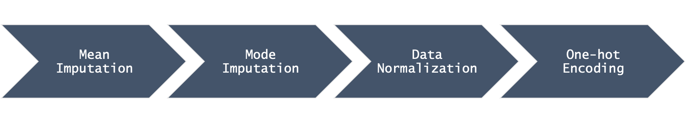
```

No further feature engineering was worked on as we expect DeepHit can do proper job on automatically learning proper representations for the problem, like other feedforward neural networks as mentioned earlier in Chapter 1.

## DeepHit's Focused Hyperparameters
Most machine learning algorithms have a set of hyperparameters of their own. These hyperparameters play a part of controlling how the algorithms behave @Goodfellow-et-al-2016. Therefore, choosing a proper set of hyperparameters is an important task to be able to achieve good performance. In this section, we present the two lists of hyperparameters of DeepHit that we focus on when tuning DeepHit model: the hyperparameters from the first list are set to fixed values while the ones from the other list are tuned based on validation set performance.

### Fixed Hyperparameters
- __optimizer__: It is the algorithm used to minimize the risk over the hypothesis space. We chose the Adam optimizer, which is also used in the original DeepHit paper and is a go-to optimization algorithm for many deep learning applications. 
- __early_stopping__: When training with an iterative optimizer like Adam, it is commonly the case that, after a certain number of iterations, generalization error begins to increase even though training error continues to decrease i.e. overfitting. Early stopping provides an intuitive yet effective approach that the optimization algorithm must be stopped early before the generalization error increases @Goodfellow-et-al-2016. This hyperparameter is set to `TRUE` for all experimental settings.
- __frac__: Fraction of data reserved for validation set is also fixed to 0.2 if the sample size is larger than 100 and to 0.4 otherwise. The validation set is used to detect when the validation loss stops improving to know when to early stop the optimization process.
- __batch_size__: It is the size of a minibatch, here it is fixed to 50. Normally, this is a hyperparameter worth tuning. However, due to technical problems we have when variating the batch size, we set it to a fixed value: 50.

### To-be-tuned Hyperparameters
- __num_nodes__: It is a very important hyperparameter of the model. This hyperparameter decides the complexity of the model via setting number of hidden layers and the number of nodes in each hidden layer.
- __learning_rate__: It controls how quickly the model is adapted to the problem. A big learning rate allows the model to learn faster, at the cost of arriving on a sub-optimal final set of weights or overshooting a better sub-optimum. A smaller learning rate may allow the model to learn a more optimal set of weights but may take significantly longer time to train.
- __dropout__: To simply put, this hyperparameter sets the probability that a neuron in a hidden layer is included during training. It is a regularization method to prevent the neural network from overfitting.
- __epochs__: This hyperparameter represents the number of training iterations over the dataset. Epochs equal to 1 means that we only look at the dataset once.
- __weight_decay__: It is another regularization hyperparameter, representing the penalty term that controls the amount of L2-regularization on the weights of the model.

These are all the hyperparameters that are chosen to focus on. The reason for these choices are because these are the hyperparameters that were used in tuning phase either in the DeepHit paper or in the examples from the `pycox` package. There are a lot more hyperparameters that were not touched during the tuning phase and left with default value set by the package.

## Hyperparameter Tuning Algorithm, Benchmark Method & Measure
In this section, we introduce the algorithms and the measure we used for hyperparameter tuning and also our benchmark method.

### Hyperparameter Tuning Algorithm
Regarding the hyperparameter tuning algorithm, we chose the _random search_ strategy @random-search. This strategy defines a search space as a bounded domain of hyperparameter values and randomly samples points in that domain. We chose this algorithm because we have so many hyperparameters to tune and grid search seems to be infeasible in this case. Another reason is that randomly chosen trials are more efficient for hyperparameter optimization than trials on a grid in highly dimensional space as shown empirically and theoretically by James Bergstra and Yoshua Bengio @random-search. Figure \@ref(fig:random-search) illustrates a case where random search is more favorable than grid search.

(ref:random-search-caption) Illustration of random search coping better than grid search with the case where there are hyperparameters that are more important than the others [@random-search].
```{r random-search, echo=FALSE, out.width="70%", fig.cap="(ref:random-search-caption)"}
# All defaults
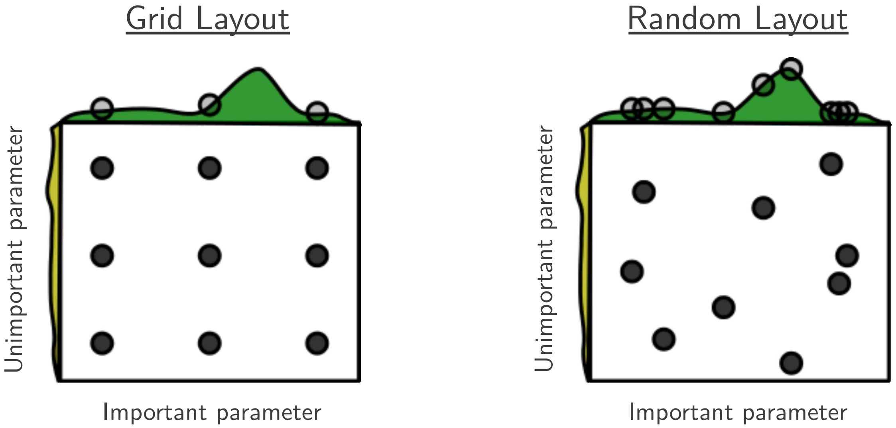
```

### Benchmark Method
Regarding the benchmark method, we chose the _nested cross validation_. Nested cross validation is a type of nested resampling, providing a way to obtain unbiased performance estimates for learners. It comprises of 2 parts, outer cross validation and inner cross validation. The inner cross validation is in charge of choosing the best set of hyperparameters and the outer cross validation is to estimate the overall performance of the model. This method is illustrated in Figure \@ref(fig:nested-resampling).

(ref:nested-resampling-caption) Illustration of nested-resampling [@mlr3-book]
```{r nested-resampling, echo=FALSE, out.width="70%", fig.cap="(ref:nested-resampling-caption)"}
# All defaults
knitr::include_graphics('nested-resampling.png')
```

In these experiments, we use nested cross validation with 5-fold cross validation for both the outer and inner cross validation.

### Measure
The measure used for hyperparameter tuning and benchmarking is the Integrated Graf Score, also known as Integrated Brier Score @ibs. The reason for using this measure for hyperparameter tuning is that it is the measure used later on to measure the performance of students' trained models in the Prediction Challenge. This measure is already implemented in `mlr3` and can be called using the function `msr("surv.graf")`. Moreover, the performance of the models is tested against the non-parametric Kaplan Meier @kaplan-meier.

## Experiments
In this section, we present a non-tuned baseline model setting for DeepHit and propose 4 experimental settings to benchmark DeepHit performance on 8 provided datasets.

### Baseline Setting for DeepHit

First and foremost, we set up a baseline model with some settings inspired from the DeepHit paper.
Here, we set the model to have 3 hidden layers, the first and the third hidden layer have  3 times `n_features` number of nodes, while the second hidden layer has 5 times `n_features` number of nodes. The `learning_rate` is set to `0.01` and `dropout` is set to `0.6`.

___Results___: Overall, the model from this baseline setting underperforms the Kaplan Meier on all datasets when benchmarked with nested cross validation on the 8 given datasets. With challenge results (tested against blackbox test samples), it underperforms the Kaplan Meier on 4 out of 8 datasets, i.e. d1, d2, d7, d9. These results can be observed from Appendix subsection \@ref(base). However, we cannot say anything about the performance of DeepHit through this setting because the hyperparameters were not tuned properly (only set to fixed values). This baseline accomplished its goal as a test to make sure the learner works as intended.

In the next subsections, we introduce four proposed experimental settings, where we keep our focus on variating the `num_nodes` configuration, or number of layers and number of nodes in each layer. The reason we choose this hyperparameter to focus on is that this hyperparameter is the key that decides the complexity or the hypothesis space of the neural network. And in order to tune `num_nodes`, we present two custom hyperparameters called `n_layers` controlling number of hidden layers and `nodes_per_layer` controlling the number of nodes per hidden layer. 

___Note___: The 4 settings presented below more or less came from our heuristics and preferences as there are no standard guidelines on how to configure DeepHit's hyperparameters.

### Common Hyperparameters Search Ranges
In the 4 proposed experimental settings, we share the following list of hyperparameters' search ranges

| __Hyperparameter__| __Search Range__                                      |
|:------------------|:------------------------------------------------------|
| `n_layers`        | `[2, 4]`                                              |
| `dropout`         | `[0.1, 0.3]`                                          |
| `learning_rate`   | `[0.005, 0.02]`                                       |
| `epochs`          | `[75, 125]`                                           |
| `weight_decay`    | `[0.0001, 0.001]`                                     |

The number of hidden layers is set to the range `[2, 4]`, inspired from the number of hidden layers of DeepHit in the original paper i.e. `3` and from the documentation of pycox's DeepHit examples i.e. `4`. Ranges of `dropout` and `epochs` are inspired from the documentation of pycox's DeepHit examples, where they set `dropout` to `0.1` and `epochs` to `100` @deephit @deephit-r.

### Experimental Setting 1 - Equally-sized Hidden Layers with Fixed Range
In this setting, we fix the range of `nodes_per_layer` to a specific range and set equal number of nodes across hidden layers. If sample size is too small (< 100), we configure the range for `nodes_per_layer` to `[16, 32]`, otherwise, we set the range to `[32, 64]`. With this heuristics, we expect the model to not overfit the dataset with very small sample size.

___Results___: Model from this setting outperforms the Kaplan Meier on datasets d4, d5, d7 when benchmarked with nested cross validation and underperforms the Kaplan Meier on the remaining datasets. When tested against the blackbox challenge test sets, the model outperforms the Kaplan Meier on datasets d1, d2, d3, d4, d5, d7, d8 and only underperforms the Kaplan Meier on dataset d9. Details can be observed from Appendix subsection \@ref(ex1).

### Experimental Setting 2 - Equally-sized Hidden Layers with Varied Range
With this setting, we adapt the range of nodes per layer depending on the number of features of that dataset. The range is set to `[x - as.integer(x/3), x + as.integer(x/3)]`, where `x = min(as.integer((min(n_features, sample_size) + 10)/2), 48)`, `x` is the average of the left and the right boundary of the range. With this setting, we impose the following heuristics:
\vspace{-0.5cm}

- The number of features should be less than the sample size. If it is not the case then the sample size is used in place of the number of features to determine the range of nodes per layer.
- The number of hidden neurons should be between the size of the input layer and the size of the output layer, hence the term `as.integer((min(n_features, sample_size) + 10)/2)` (average of the input layer size and the output layer size), where the input layer size is the number of features, and the output layer size is `10`, by default as in the DeepHit pycox implementation @deephit-r. This heuristic is inspired from the rule of thumb when choosing the number of neurons in the hidden layers in the book "Introduction to Neural Networks for Java" @heaton2005neural.
- The average number of hidden neurons should not exceed `48`. This heuristic is imposed to limit the complexity of the model.

___Results___: Model from this setting outperforms the Kaplan Meier on datasets d1, d5, d7 when benchmarked with nested cross validation and underperforms the Kaplan Meier on the remaining datasets. When tested against the blackbox challenge test sets, as in experimental setting 1, the model outperforms the Kaplan Meier on datasets d1, d2, d3, d4, d5, d7, d8 and only underperforms the Kaplan Meier on dataset d9. Details can be observed from  from Appendix subsection \@ref(ex2).

### Experimental Setting 3 - Differently-sized Hidden Layers with Fixed Range
In this setting, we continue to fix the range of nodes per layer to a specific range as in experimental setting 1. Also, we impose a new heuristic that nodes in central hidden layers are larger than first and last hidden layer’s with a factor of 5/3. For example, if the first and last hidden layer have the number of nodes of 33 (`nodes_per_layer = 33`), then the central hidden layers (if there are) will have the number of nodes of 55. This heuristic is inspired from DeepHit paper, where the second hidden layer is 5/3 times the number of nodes in the first and third hidden layer @deephit.

___Results___: Model from this setting outperforms the Kaplan Meier on datasets d1, d4, d5, d7 when benchmarked with nested cross validation and underperforms the Kaplan Meier on the remaining datasets. When tested against the blackbox challenge test sets, the model outperforms the Kaplan Meier on datasets d1, d2, d3, d4, d5, d7, d8 and only underperforms the Kaplan Meier on dataset d9. Details can be observed from  from Appendix subsection \@ref(ex3).

### Experimental Setting 4 - Differently-sized Hidden Layers with Varied Range
With this setting, we not only adapt the range of nodes per layer depending on the number of features of that dataset (as in experimental setting 2) but also impose the heuristic that nodes in central hidden layers are larger than first and last hidden layer’s with a factor of 5/3 (as in experimental setting 3).

___Results___: Model from this setting outperforms the Kaplan Meier on datasets d1, d5, d7 when benchmarked with nested cross validation and underperforms the Kaplan Meier on the remaining datasets. When tested against the blackbox challenge test sets, like the 3 previous experimental settings, the model from experimental setting 4 outperforms the Kaplan Meier on datasets d1, d2, d3, d4, d5, d7, d8 and only underperforms the Kaplan Meier on dataset d9 (Appendix subsection \@ref(ex4)).

### Remarks
- There is no clear dominance in performance of any proposed setting over others. 
- The four proposed settings show improvements in performance over the paper-inspired baseline model: the proposed settings all outperform the Kaplan Meier on 7 out of 8 datasets (all except for d9) while the paper-inspired baseline model only outperforms the Kaplan Meier on 4 out of 8 datasets. This shows the importance of hyperparameter tuning with DeepHit or deep neural networks in general.
- When benchmarked with nested cross validation, the four settings outperform the Kaplan Meier on dataset d5 (1782 x 81), d7 (1800 x 12), which are the two ___largest___ datasets in total 8 challenge datasets. Therefore, it can be observed that sample size can have a measurable impact on the final performance of deep learning, or DeepHit in this case. We can also refer to DeepHit paper itself, where there were experiments with 2 single risk datasets, they are The United Network for Organ Sharing (UNOS) database with sample size of more than 60,000, and METABRIC The Molecular Taxonomy of Breast Cancer International Consortium (METABRIC) dataset with roughly 2,000 samples @deephit.
- Although the proposed settings can only outperform the Kaplan Meier on at most 4 out of 8 provided datasets, the challenge performance of them is better than the Kaplan Meier on most of the datasets, except for dataset d9. One speculation is that with nested CV, only 80% of the dataset is used for training, this smaller training set may be insufficient for DeepHit to learn the characteristics of the datasets, that can be a fair reason for the outperformance of tuned DeepHit over Kaplan Meier in the prediction challenge.
- It is surprising to see the 4 tuned DeepHit models (corresponding to 4 experimental settings) outperform the Kaplan Meier in the dataset d8, where the sample size is only 30 and there are 2 features. However, the blackbox test set for that dataset has only 4 instances so there is a high chance that the 4 tuned DeepHit models just got lucky this time.

# Conclusion
This chapter presents the results of this thesis, including what we have learned, what we achieved through the experiments, and also the difficulties we met when working on model tuning, training, benchmarking.

## What We Learnt & Achieved
Over the course of this thesis, we spent a good amount of time studying Deep Neural Network, especially Feedforward Neural Network in general and its application to the task of survival analysis. We have seen multiple attempts throughout the years to get Feedforward Neural Network better at that task. Through the first seminar, we also knew more about other machine learning algorithms used to work on survival analysis such as random forest, support vector machine, etc.

Moreover, we also got a chance to work with `R` and machine learning library `mlr3` to learn how to set up a pipeline to train, tune, and benchmark a machine learning model in general and DeepHit model in particular.

Through experiments, we proposed 4 experimental settings aiming at better tuning the DeepHit model to improve performance on the 8 provided datasets. From the experimental results, it can be seen that DeepHit's model is very sensitive to hyperparameter tuning, and sample size can greatly impact the performance of DeepHit. 

## Difficulties & Limitations
In the process of tuning, training, benchmarking model, we had multiple problems:

```{r batch-size-error, eval=FALSE}
Error in py_call_impl(callable, dots$args, dots$keywords) : 
  ValueError: Expected more than 1 value per channel when training, 
              got input size torch.Size([1, 3])
```
- When we attempted to variate the batch size i.e. to define a range for the batch size to be tuned via random search, we got the error as in code snippet above. Because we hadn't found the reason for this error yet, we resorted to fix the value of batch size to 50.

- Another problem is to tune untyped hyperparameters. As there were few documentation on how to deal with these types of hyperparameters on `mlr3`'s documentation sites such as `mlr3book` or `mlr3gallery`, it took us a lot of time until we found a workable solution. That is to use the `trafo` (transform) function of `ParamSet` object:
```{r, eval=FALSE}
  deephit_search_space$trafo = function(x, param_set) {
    x$surv.deephit.num_nodes = rep(as.integer(as.character(x$nodes_per_layer)), 
                                   x$n_layers)
    x$nodes_per_layer = x$n_layers = NULL
    return(x)
  }
```
- The benchmark process with nested cross validation is very computationally expensive. With every benchmarking task of an experimental setting on 8 datasets, it took more than 12 hours to get the result. Moreover, we ran into the problem of memory shortage because a tuned deep learning model is large. We had to set up a cloud virtual machine to cater for the task. 

\newpage
# References


<div id="refs"></div>
\newpage

\appendix

# Appendix
The appendix is included for further reading. In this part, we introduce 2 models using RNN in survival analysis and also the plots and tables from the experiments we present in chapter \@ref(experiments-results).

## Recurrent Neural Network Models in Survival Analysis
This section of the appendix gives some concrete examples about RNN applications in survival analysis.

### RNN-Surv (Giunchiglia et al.) (2018)
Before RNN-Surv, there had not been published results applying RNN in survival analysis @rnn-surv. By taking advantage of RNN structure, RNN-Surv's authors managed to model the possible time-variant effects of the covariates and the dependence structure of survival probability of consecutive timesteps.

For an individual $i$, RNN-Surv deals with survival analysis problem by dividing it into $K$ binary sub-problems on the intervals $(t_0,t_1],...,(t_{K-1},t_K]$. The goal is to model the survival probability estimate $\hat{y}_i^{(k)}$ for each of the $k$-th time interval and then linearly combine $K$ survival probability estimates to produce the final risk score $\hat{r}_i$. The model is structured as follows:
\vspace{-0.5cm}

- The input layer consists of $K$ covariate vectors $\mathbf{x}_i^{(k)}$ for each of the time interval.
- The input is then passed through a feedforward neural network to extract a more meaningful representation of the data (embedding step).
- The embedded data is then passed through an RNN and a sigmoid activation to give out $K$ survival probability estimates $\hat{y}_i^{(k)}$.
- The results from the RNN will then be linearly combined to compute the final risk score: $\hat{r}_i = \sum_{k = 1}^{K} \hat{y}_i^{(k)}$.

The loss function of this model is defined as a linear combination of two sub-losses $\mathcal{L}_1$ and $\mathcal{L}_2$, with the summation coefficients set as hyperparamaters to be optimized during validation.
\vspace{-0.5cm}

- $\mathcal{L}_1$ integrates $K$ binary sub-problems' losses with the cross-entropy loss.
- $\mathcal{L}_2$ is defined as an upper bound on the C-index @c-idx-bound, which is less computationally expensive than the negative C-index.

The model settings are as follows: dropout is applied to feedforward layers and recurrent layers, together with early stopping. The model also uses L2-regularization to the linear combination of the losses. The network is trained using Adam optimizer and mini-batching. Before used for training, the data is preprocessed by first imputing missing value (using mean value for continuous features and using the most recurrent value for categorical ones) and second using one-hot encoding for categorical features and standardizing each feature.

### Dynamic-DeepHit (Lee et al.) (2019)
Dynamic-DeepHit is a powerful extension of the original DeepHit mentioned in the previous section @dynamic-deephit. As a result, it inherits the ability of DeepHit in learning directly the time-to-event distribution without making any strict assumption on the underlying stochastic process and in dealing with competing risks naturally. In addition, Dynamic-DeepHit can also work with time-varying covariates. This helps Dynamic-DeepHit take advantage of the amount of data available over time rather than just rely on the last available measurements like its predecessor.

Similar to DeepHit's architecture, Dynamic-DeepHit's is also structured as a multi-task network:
\vspace{-0.45cm}

- A _shared sub-network_: This sub-network includes 2 parts:
    - An RNN structure to capture information from longitudinal covariates. It can flexibly handle longitudinal data where each observation has different number of measurements and not every predictor is observed at each measurement (partially missing).
    - A temporal attention mechanism @temporal-attention-mechanism to enable the network to make decision on the parts of the past longitudinal measurements to focus on. It is formally defined as a weighted sum of the hidden states @dynamic-deephit.
- $K$ _cause-specific sub-networks_: Each cause-specific sub-network of Dynamic-DeepHit is a feedforward neural network with the goal of extracting information about underlying connections between the event and the history of measurements. The outputs of these sub-networks $f_{c_k}$ correspond to the probabilities of event times for each of the causes.
- An _output layer_: Similar to DeepHit, this output layer will combine $K$ output vectors from the cause-specific sub-networks and apply the softmax activation function to give out a proper probability measure that represents the estimate of join distribution of the events and the event times.

The loss function of this neural network $\mathcal{L}_{total}$ is defined as combination of the three losses:
\vspace{-0.45cm}

- $\mathcal{L}_1$: the negative log-likelihood of the joint distribution of the events and the event times, taking into consideration of the right-censored data.
- $\mathcal{L}_2$: this loss penalizes the incorrect ordering of pairs with respect to each event based on the concordance rule: any observation with event time $t$ should have a higher risk at event time $t$ than another observation with event time greater than $t$.
- $\mathcal{L}_3$: this loss plays a part of regularizing the shared sub-network in the sense that the hidden representation of the data (at time $t_j$) should preserve information for step-ahead prediction (at time $t_{j + 1}$).

The model is trained using Adam optimizer with various mini-batch sizes. Moreover, to prevent the model from overfitting, the authors used early-stopping based on the performance and L1 regularization for the cause-specific sub-networks and output layer. For evaluating on datasets, the authors used 5-fold cross validation and used 20% of the data from training set to be validation set. The hyper-parameters for the activation functions, coefficients, number of hidden layers/nodes were performed using Random Search.

### Summary
Dynamic-DeepHit and RNN-SURV present the power of RNNs in working on sequential data, in this case the time-varying covariates. Furthermore, with Dynamic-DeepHit, it incorporates all the abilities of DeepHit like handling non-linearities, capturing time-varying effects and dealing with competing risks.\
However, missing values were cared in the data preprocessing step by using imputation methods and heuristics. There is no natural way for Dynamic-DeepHit and RNN-SURV network to deal with this problem. In addition, problems like left-truncation, left-censoring and interval-censoring were not taken into consideration in the methods.

## Experimental Results - Tables & Graphs
In this section, the detailed experimental results are given under the form of graphs and tables.

### Baseline Setting for DeepHit {#base}
The detailed benchmark results and the blackbox test results of the paper-inspired baseline model against 8 provided datasets can be observed at Figure \@ref(fig:paper-inspired-baseline-settings-nested-cv-boxplots) and Figure \@ref(fig:paper-inspired-baseline-settings-results).
```{r paper-inspired-baseline-settings-nested-cv-boxplots, echo=FALSE, out.width="80%", fig.cap="Paper-inspired Baseline Setting's Benchmark Results"}
# All defaults
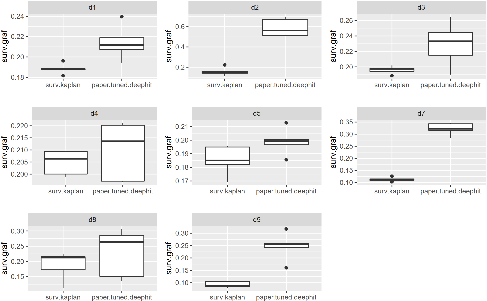
```

```{r paper-inspired-baseline-settings-results, echo=FALSE, out.width="80%", fig.cap="Paper-inspired Baseline Setting's Performance Results"}
# All defaults
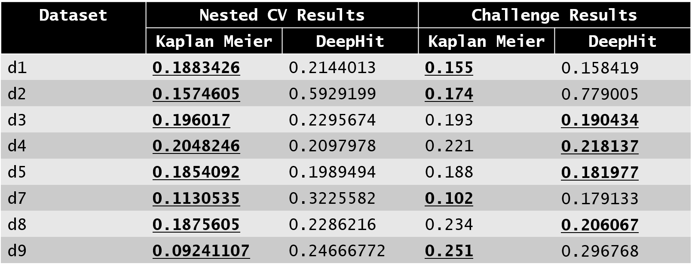
```

### Experimental Setting 1 - Equally-sized Hidden Layers with Fixed Range {#ex1}
The detailed benchmark results and the blackbox test results of experimental setting 1 against 8 provided datasets can be observed at Figure \@ref(fig:equally-sized-hidden-layers-w-fixed-range-nested-cv-boxplots) and Figure \@ref(fig:equally-sized-hidden-layers-w-fixed-range-results).
```{r equally-sized-hidden-layers-w-fixed-range-nested-cv-boxplots, echo=FALSE, out.width="80%", fig.cap="Equally-sized Hidden Layers with Fixed Range Setting's Benchmark Results"}
# All defaults
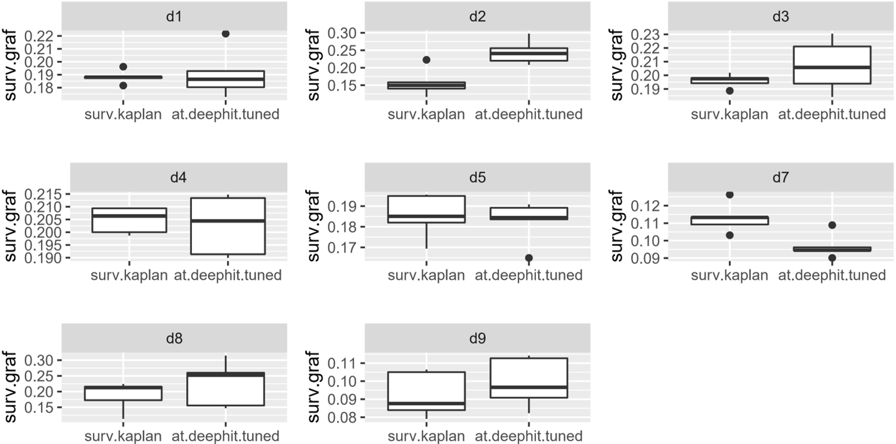
```

```{r equally-sized-hidden-layers-w-fixed-range-results, echo=FALSE, out.width="80%", fig.cap="Equally-sized Hidden Layers with Fixed Range Setting's Performance Results"}
# All defaults
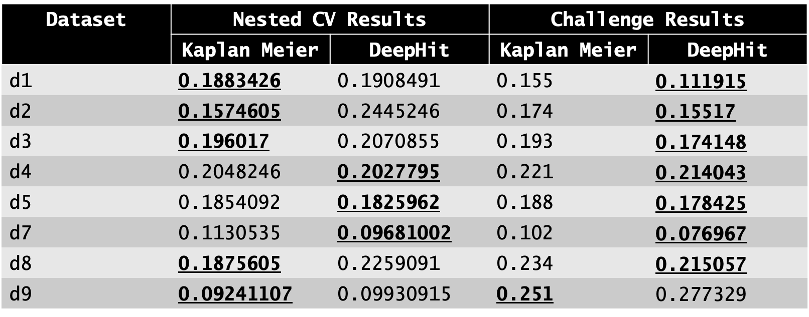
```

### Experimental Setting 2 - Equally-sized Hidden Layers with Varied Range {#ex2}
The detailed benchmark results and the blackbox test results of experimental setting 2 against 8 provided datasets can be observed at Figure \@ref(fig:equally-sized-hidden-layers-w-varied-range-nested-cv-boxplots) and Figure \@ref(fig:equally-sized-hidden-layers-w-varied-range-results).
```{r equally-sized-hidden-layers-w-varied-range-nested-cv-boxplots, echo=FALSE, out.width="80%", fig.cap="Equally-sized Hidden Layers with Varied Range Setting's Benchmark Results"}
# All defaults
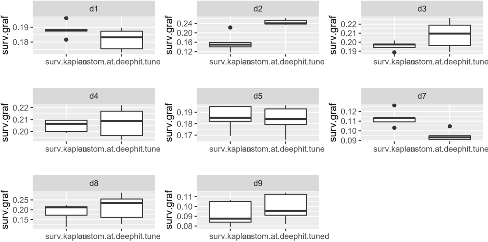
```

```{r equally-sized-hidden-layers-w-varied-range-results, echo=FALSE, out.width="80%", fig.cap="Equally-sized Hidden Layers with Varied Range Setting's Performance Results"}
# All defaults
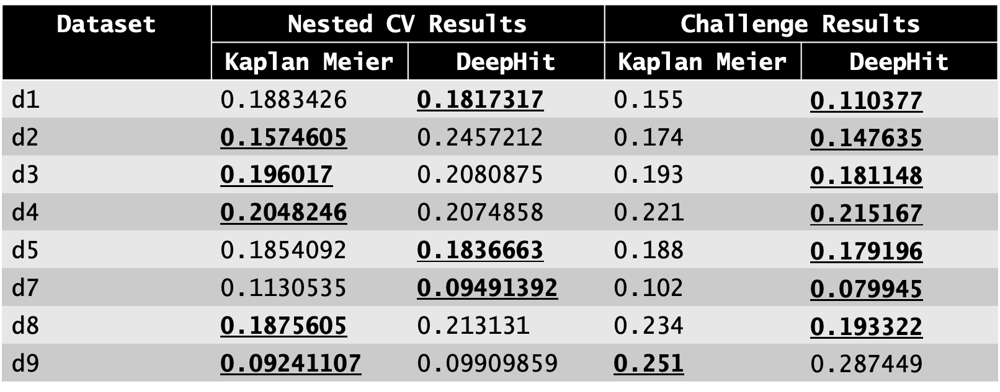
```

### Experimental Setting 3 - Differently-sized Hidden Layers with Fixed Range {#ex3}
The detailed benchmark results and the blackbox test results of experimental setting 3 against 8 provided datasets can be observed at Figure \@ref(fig:differently-sized-hidden-layers-w-fixed-range-nested-cv-boxplots) and Figure \@ref(fig:differently-sized-hidden-layers-w-fixed-range-results).
```{r differently-sized-hidden-layers-w-fixed-range-nested-cv-boxplots, echo=FALSE, out.width="80%", fig.cap="Differently-sized Hidden Layers with Fixed Range Setting's Benchmark Results"}
# All defaults
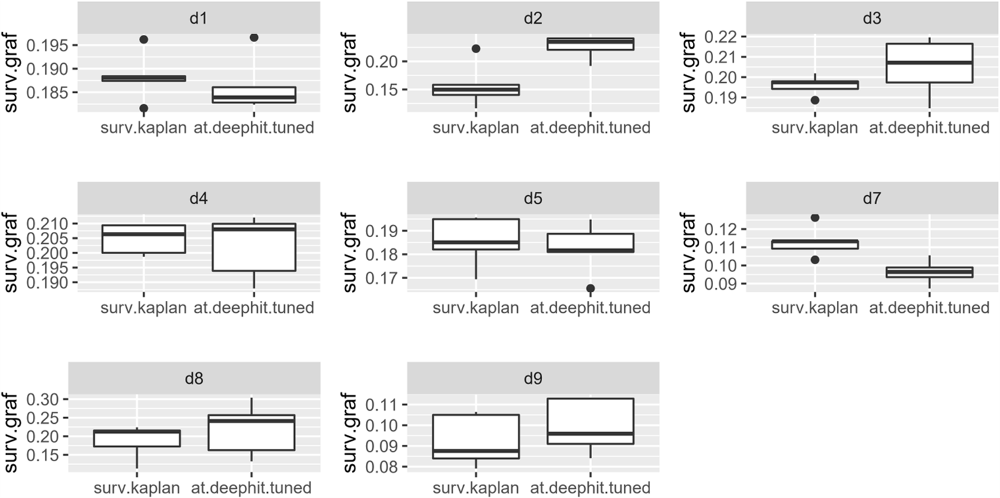
```

```{r differently-sized-hidden-layers-w-fixed-range-results, echo=FALSE, out.width="80%", fig.cap="Equally-sized Hidden Layers with Fixed Range Setting's Performance Results"}
# All defaults
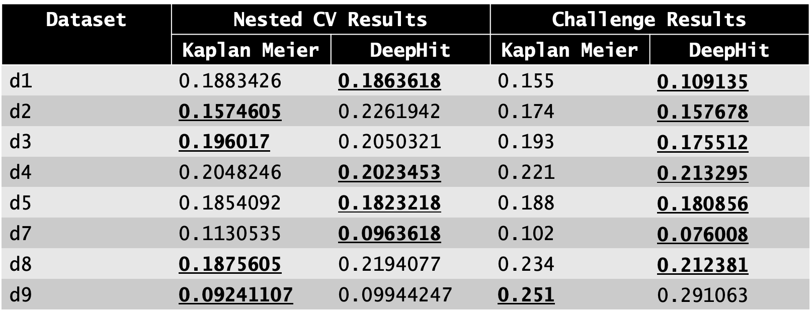
```

### Experimental Setting 4 - Differently-sized Hidden Layers with Varied Range {#ex4}
The detailed benchmark results and the blackbox test results of experimental setting 4 against 8 provided datasets can be observed at Figure \@ref(fig:differently-sized-hidden-layers-w-varied-range-nested-cv-boxplots) and Figure \@ref(fig:differently-sized-hidden-layers-w-varied-range-results).
```{r differently-sized-hidden-layers-w-varied-range-nested-cv-boxplots, echo=FALSE, out.width="80%", fig.cap="Differently-sized Hidden Layers with Varied Range Setting's Benchmark Results"}
# All defaults
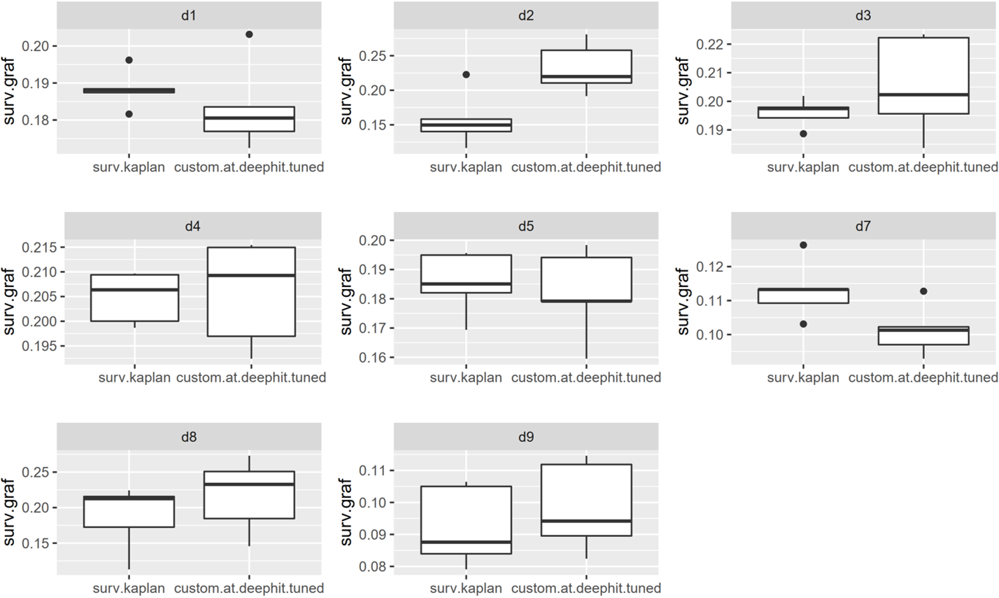
```

```{r differently-sized-hidden-layers-w-varied-range-results, echo=FALSE, out.width="80%", fig.cap="Differently-sized Hidden Layers with Varied Range Setting's Performance Results"}
# All defaults
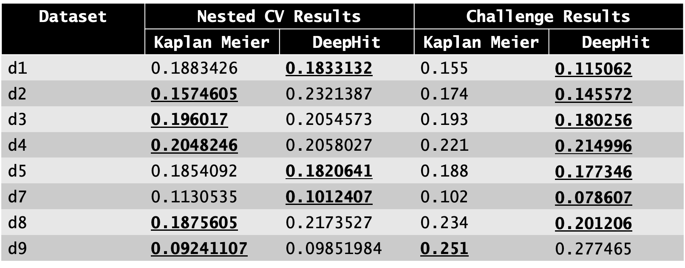
```


